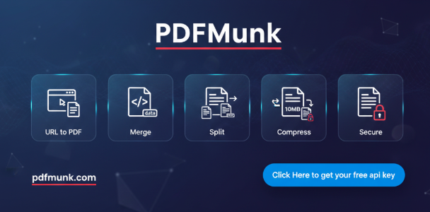

# n8n-nodes-htmlcsstopdf

[](https://pdfmunk.com/)

**Get your api key from** [https://pdfmunk.com](https://pdfmunk.com)

**For PDF Split/Merge and other powerful PDF features**, try our new product [PDFAPIHub](https://pdfapihub.com)

An n8n community node for creating PDFs from HTML/CSS or URLs, manipulating PDFs (merge/split/compress), securing PDFs (lock/unlock), and parsing PDFs to structured JSON — powered by the PDFMunk API.

## Features

- **PDF Creation**
  - **HTML to PDF**: Render HTML + optional CSS into a PDF
  - **URL to PDF**: Capture a website as a PDF (full-page support)
  - **Dynamic Params**: Template placeholder replacement for HTML generation
  - **Viewport Control**: Configure viewport width/height
  - **Flexible Output**: Return a direct URL or a binary PDF file
  - **Output Filename**: Set the resulting PDF filename
  - **Configurable Timeout**: Increase timeouts for large/slow renders
- **PDF Manipulation**
  - **Merge PDFs**: Merge 2–15 PDFs from URLs or multiple binary PDF inputs
  - **Split PDF**: Extract specific pages, split each page, or split into chunks
  - **Compress PDF**: Reduce file size with selectable compression levels
  - **Watermark PDF**: Add text watermark with angle/opacity/font controls
  - **Convert PDF to Image**: Convert selected pages to PNG/JPG/JPEG/WEBP
  - **Convert Image to PDF**: Merge one or multiple images into a PDF
- **PDF Security**
  - **Lock PDF**: Add password protection (optionally provide input password for already-encrypted PDFs), via URL or file input
  - **Unlock PDF**: Remove password protection, via URL or file input
- **PDF Extraction & Parsing**
  - **Parse PDF to JSON**: Extract text/layout/tables/full extraction with page selection, via URL or file input
  - **Parse PDF with OCR**: OCR parse scanned PDFs with language/PSM/OEM settings

## Installation

Follow the [installation guide](https://docs.n8n.io/integrations/community-nodes/installation/) in the n8n community nodes documentation.

### Community Nodes (Recommended)

1. Go to **Settings > Community Nodes** in your n8n instance
2. Click **Install a community node**
3. Enter `n8n-nodes-htmlcsstopdf`
4. Click **Install**

### Manual Installation

```bash
# Navigate to your n8n installation directory
cd ~/.n8n/nodes

# Install the package
npm install n8n-nodes-htmlcsstopdf
```

### Docker

Add the package to your n8n Docker container:

```dockerfile
FROM n8nio/n8n:latest
USER root
RUN npm install -g n8n-nodes-htmlcsstopdf
USER node
```

## Getting Your PDFMunk API Key

1. **Sign Up**: Visit [PDFMunk.com](https://pdfmunk.com) and create an account
2. **Verify Email**: Check your email and verify your account
3. **Access Dashboard**: Log in to your PDFMunk dashboard
4. **Generate API Key**: 
   - Navigate to the "API Keys" section
   - Click "Generate New API Key"
   - Copy your API key securely
5. **Choose Plan**: Select a plan based on your usage needs (see PDFMunk pricing for current limits).

## Configuration

### Setting Up Credentials

1. In n8n, go to **Credentials**
2. Click **+ Add Credential**
3. Search for "HtmlCssToPdf API"
4. Enter your PDFMunk API key
5. Test the connection
6. Save the credential

## Operations

The node exposes operations grouped by **Resource**.

### PDF Creation

#### HTML to PDF
Generate a PDF from custom HTML and optional CSS.

**Parameters:**
- **HTML Content** (`html_content`)
- **CSS Content** (`css_content`, optional)
- **Dynamic Params** (`dynamic_params`, optional key/value pairs for templating)
- **Viewport Width/Height** (`viewPortWidth`, `viewPortHeight`)
- **Output Format** (`output_format`: `url` or `file`)
- **Output Filename** (`output_filename`, without `.pdf`)
- **Timeout (in Seconds)** (`timeout`, default: 300)

#### URL to PDF
Generate a PDF from a website URL.

**Parameters:**
- **URL** (`url`)
- **Full Page** (`full_page`, default: `true`)
- **Wait Till** (`wait_till`, milliseconds to wait before capture)
- **Viewport Width/Height** (`viewPortWidth`, `viewPortHeight`)
- **Output Format** (`output_format`: `url` or `file`)
- **Output Filename** (`output_filename`, without `.pdf`)
- **Timeout (in Seconds)** (`timeout`, default: 300)

### PDF Manipulation

#### Merge PDFs
Merge multiple PDFs into one document.

**Parameters:**
- **Input Type** (`merge_input_type`: `url` or `file`)
- **PDF URLs** (`pdf_urls`, comma-separated; minimum 2, maximum 15; URL mode)
- **File Binary Property Name (CSV)** (`merge_file_binary_properties`, file mode)
- **Output Type** (`merge_output`: `url`, `file`, or `base64`)

#### Split PDF
Split or extract pages from a PDF.

**Parameters:**
- **Input Type** (`split_input_type`: `url` or `file`)
- **PDF URL** (`split_url`, URL mode)
- **File Binary Property** (`split_file_binary_property`, file mode)
- **Split Mode** (`split_mode`)
  - `pages`: extract a page range/list via **Page Range** (`pages`)
  - `each`: split each page into its own PDF
  - `chunks`: split into **Number of Chunks** (`chunks`)
- **Output Type** (`split_output`: `url`, `file`, or `base64`)

#### Compress PDF
Compress a PDF to reduce file size.

**Parameters:**
- **Input Type** (`compress_input_type`: `url` or `file`)
- **PDF URL** (`compress_url`, max 10MB, URL mode)
- **File Binary Property** (`compress_file_binary_property`, file mode)
- **Compression Level** (`compression`: `low`, `medium`, `high`, `max`)
- **Output Type** (`compress_output`: `url`, `file`, or `base64`)
- **Output Filename** (`compress_output_name`, e.g. `compressed.pdf`)

#### Watermark PDF
Add text watermark to a PDF.

**Parameters:**
- **Input Type** (`watermark_input_type`: `url` or `file`)
- **PDF URL** (`watermark_file_url`, URL mode)
- **File Binary Property** (`watermark_file_binary_property`, file mode)
- **Output Format** (`watermark_output_format`: `file`, `url`, `base64`, or `both`)
- **Watermark Text** (`watermark_text`)
- **Opacity** (`watermark_opacity`)
- **Angle** (`watermark_angle`)
- **Font Size** (`watermark_font_size`, optional)

#### Convert PDF to Image
Convert one or more PDF pages to images.

**Parameters:**
- **Input Type** (`convert_pdf_image_input_type`: `url` or `file`)
- **PDF URL** (`convert_pdf_image_url`, URL mode)
- **File Binary Property** (`convert_pdf_image_file_binary_property`, file mode)
- **Page** (`convert_pdf_image_page`, used when `Pages` is empty)
- **Pages** (`convert_pdf_image_pages`, e.g. `1-3` or `1,3,5`)
- **Image Format** (`convert_pdf_image_format`: `png`, `jpg`, `jpeg`, `webp`)
- **DPI** (`convert_pdf_image_dpi`)
- **Quality** (`convert_pdf_image_quality`)
- **Output Type** (`convert_pdf_image_output`: `url`, `base64`, `both`, or `file`)

#### Convert Image to PDF
Convert one or multiple image URLs into a PDF.

**Parameters:**
- **Image URLs** (`convert_image_pdf_urls`, comma-separated)
- **Output Type** (`convert_image_pdf_output`: `url`, `base64`, `both`, or `file`)
- **Output Filename** (`convert_image_pdf_filename`)

### PDF Security

#### Lock PDF
Add password protection to a PDF.

**Parameters:**
- **Input Type** (`lock_input_type`: `url` or `file`)
- **PDF URL** (`lock_url`, max 10MB, URL mode)
- **File Binary Property** (`lock_file_binary_property`, file mode)
- **Password** (`lock_password`)
- **Input Password** (`lock_input_password`, optional)
- **Output Type** (`lock_output`: `url`, `file`, or `base64`)
- **Output Filename** (`lock_output_name`, e.g. `locked.pdf`)

#### Unlock PDF
Remove password protection from a PDF.

**Parameters:**
- **Input Type** (`unlock_input_type`: `url` or `file`)
- **PDF URL** (`unlock_url`, max 10MB, URL mode)
- **File Binary Property** (`unlock_file_binary_property`, file mode)
- **Password** (`unlock_password`)
- **Output Type** (`unlock_output`: `url`, `file`, or `base64`)
- **Output Filename** (`unlock_output_name`, e.g. `unlocked.pdf`)

### PDF Extraction & Parsing

#### Parse PDF
Parse a PDF into structured JSON.

**Parameters:**
- **Input Type** (`parse_input_type`: `url` or `file`)
- **PDF URL** (`parse_url`, URL mode)
- **File Binary Property** (`parse_file_binary_property`, file mode)
- **Parse Mode** (`parse_mode`: `text`, `layout`, `tables`, `full`)
- **Pages** (`parse_pages`: `all` or ranges like `1-3`)

#### Parse PDF with OCR
Parse scanned PDFs using OCR.

**Parameters:**
- **Input Type** (`parse_input_type`: `url` or `file`)
- **PDF URL** (`parse_url`, URL mode)
- **File Binary Property** (`parse_file_binary_property`, file mode)
- **Language** (`lang`, e.g. `eng` or `eng+hin`)
- **Pages** (`parse_pages`: `all` or ranges like `1-3`)
- **DPI** (`dpi`)
- **PSM** (`psm`)
- **OEM** (`oem`)

## Usage

### Basic HTML to PDF Conversion

```json
{
  "operation": "htmlToPdf",
  "html_content": "<h1>Hello World</h1><p>This is a test document.</p>",
  "css_content": "h1 { color: blue; } p { font-size: 14px; }",
  "viewPortWidth": 1080,
  "viewPortHeight": 720,
  "output_format": "file",
  "output_filename": "hello-world",
  "timeout": 300
}
```

### Advanced Usage Examples

#### 1. Invoice Generation
```html
<!DOCTYPE html>
<html>
<head>
    <style>
        .invoice { font-family: Arial, sans-serif; }
        .header { background-color: #f0f0f0; padding: 20px; }
        .total { font-weight: bold; font-size: 18px; }
    </style>
</head>
<body>
    <div class="invoice">
        <div class="header">
            <h1>Invoice #12345</h1>
        </div>
        <div class="total">Total: $299.99</div>
    </div>
</body>
</html>
```

#### 2. Report Generation
```html
<div class="report">
    <h1>Monthly Report</h1>
    <table border="1">
        <tr><th>Metric</th><th>Value</th></tr>
        <tr><td>Sales</td><td>$50,000</td></tr>
        <tr><td>Growth</td><td>15%</td></tr>
    </table>
</div>
```

#### 3. Certificate Generation
```html
<div class="certificate">
    <h1>Certificate of Completion</h1>
    <p>This certifies that <strong>John Doe</strong> has completed the course.</p>
    <div class="signature">Authorized Signature</div>
</div>
```

### PDF Manipulation Examples

#### Merge PDFs
```json
{
  "resource": "pdfManipulation",
  "operation": "mergePdfs",
  "merge_input_type": "url",
  "pdf_urls": "https://example.com/a.pdf, https://example.com/b.pdf",
  "merge_output": "url"
}
```

#### Merge PDFs (File input)
```json
{
  "resource": "pdfManipulation",
  "operation": "mergePdfs",
  "merge_input_type": "file",
  "merge_file_binary_properties": "data1,data2",
  "merge_output": "file"
}
```

#### Split PDF (extract pages)
```json
{
  "resource": "pdfManipulation",
  "operation": "splitPdf",
  "split_input_type": "url",
  "split_url": "https://example.com/document.pdf",
  "split_mode": "pages",
  "pages": "1-3",
  "split_output": "url"
}
```

#### Compress PDF
```json
{
  "resource": "pdfManipulation",
  "operation": "compressPdf",
  "compress_input_type": "url",
  "compress_url": "https://example.com/document.pdf",
  "compression": "high",
  "compress_output": "file",
  "compress_output_name": "compressed.pdf"
}
```

#### Watermark PDF
```json
{
  "resource": "pdfManipulation",
  "operation": "watermarkPdf",
  "watermark_input_type": "url",
  "watermark_file_url": "https://example.com/document.pdf",
  "watermark_output_format": "file",
  "watermark_text": "CONFIDENTIAL",
  "watermark_opacity": 0.15,
  "watermark_angle": 30
}
```

#### Convert PDF to Image
```json
{
  "resource": "pdfManipulation",
  "operation": "convertPdfToImage",
  "convert_pdf_image_input_type": "url",
  "convert_pdf_image_url": "https://example.com/document.pdf",
  "convert_pdf_image_pages": "1-3",
  "convert_pdf_image_format": "png",
  "convert_pdf_image_output": "url"
}
```

#### Convert Image to PDF
```json
{
  "resource": "pdfManipulation",
  "operation": "convertImageToPdf",
  "convert_image_pdf_urls": "https://example.com/a.png, https://example.com/b.jpg",
  "convert_image_pdf_output": "file",
  "convert_image_pdf_filename": "combined-images.pdf"
}
```

### PDF Security Examples

#### Lock PDF
```json
{
  "resource": "pdfSecurity",
  "operation": "lockPdf",
  "lock_input_type": "url",
  "lock_url": "https://example.com/document.pdf",
  "lock_password": "your-password",
  "lock_output": "file",
  "lock_output_name": "locked.pdf"
}
```

#### Unlock PDF
```json
{
  "resource": "pdfSecurity",
  "operation": "unlockPdf",
  "unlock_input_type": "url",
  "unlock_url": "https://example.com/locked.pdf",
  "unlock_password": "your-password",
  "unlock_output": "file",
  "unlock_output_name": "unlocked.pdf"
}
```

### PDF Parsing Example

#### Parse PDF to JSON
```json
{
  "resource": "pdfParsing",
  "operation": "parsePdf",
  "parse_input_type": "url",
  "parse_url": "https://example.com/document.pdf",
  "parse_mode": "full",
  "parse_pages": "all"
}
```

#### Parse PDF with OCR
```json
{
  "resource": "pdfParsing",
  "operation": "parsePdfOcr",
  "parse_input_type": "url",
  "parse_url": "https://example.com/scanned.pdf",
  "lang": "eng",
  "parse_pages": "all",
  "dpi": 200,
  "psm": 3,
  "oem": 3
}
```

## Use Cases

### Business Applications
- **Invoice Generation**: Automatically generate invoices from order data
- **Report Creation**: Convert analytics data into professional PDF reports
- **Contract Generation**: Create contracts from templates with dynamic data
- **Certificate Issuance**: Generate certificates for course completions
- **Receipt Creation**: Convert transaction data into PDF receipts

### Content Management
- **Document Archival**: Convert web pages to PDF for archival purposes
- **Newsletter PDFs**: Transform HTML newsletters into PDF format
- **eBook Creation**: Generate PDF books from HTML content
- **Documentation**: Convert online docs to downloadable PDFs

### Marketing & Sales
- **Proposal Generation**: Create branded proposals from CRM data
- **Brochure Creation**: Generate marketing materials dynamically
- **Price Lists**: Convert product catalogs to PDF format
- **Quotation PDFs**: Transform quotes into professional PDFs

## Workflow Examples

### Example 1: E-commerce Invoice
```json
{
  "nodes": [
    {
      "name": "Order Webhook",
      "type": "n8n-nodes-base.webhook"
    },
    {
      "name": "Generate Invoice HTML",
      "type": "n8n-nodes-base.function"
    },
    {
      "name": "Convert to PDF",
      "type": "n8n-nodes-htmlcsstopdf.htmlcsstopdf"
    },
    {
      "name": "Email PDF",
      "type": "n8n-nodes-base.emailSend"
    }
  ]
}
```

### Example 2: Scheduled Reports
```json
{
  "nodes": [
    {
      "name": "Schedule Trigger",
      "type": "n8n-nodes-base.cron"
    },
    {
      "name": "Fetch Analytics Data",
      "type": "n8n-nodes-base.httpRequest"
    },
    {
      "name": "Build Report HTML",
      "type": "n8n-nodes-base.function"
    },
    {
      "name": "Generate PDF Report",
      "type": "n8n-nodes-htmlcsstopdf.htmlcsstopdf"
    },
    {
      "name": "Save to Google Drive",
      "type": "n8n-nodes-base.googleDrive"
    }
  ]
}
```

## Output

The node returns:
- **URL output**: A direct link (or URL(s), depending on operation)
- **File output**: Binary PDF file data in n8n (usable by "Write Binary File", email attachments, etc.)
- **Base64 output** (where available): Base64-encoded result in the JSON response

## Error Handling

The node provides detailed error messages for common issues:

- **Invalid API Key**: Check your PDFMunk credentials
- **HTML Parse Error**: Validate your HTML syntax
- **CSS Error**: Check your CSS for syntax errors
- **Rate Limit**: Upgrade your PDFMunk plan or wait for reset
- **Network Error**: Check your internet connection
- **Timeout Error**: Increase the timeout setting for large PDFs (default: 300 seconds)

## FAQ

**Q: Is there a free tier?**  
A: PDFMunk may offer trial/free usage depending on current plans. Check the PDFMunk dashboard/pricing for the latest limits.

**Q: What HTML features are supported?**  
A: Most modern HTML5 and CSS3 features are supported, including flexbox, grid, and media queries.

**Q: Can I use external images?**  
A: Yes, images accessible via URL will be included in the PDF.

**Q: What's the maximum file size?**  
A: Some operations in this node expect PDFs up to 10MB (as indicated in the node parameters). Check PDFMunk documentation for current limits and plan-specific constraints.

**Q: How do I generate large PDFs (100+ pages)?**  
A: Increase the timeout setting in the node configuration. For large PDFs, set timeout to 600-900 seconds (10-15 minutes).

**Q: What should I do if I get a gateway timeout error?**  
A: Increase the timeout parameter in the node settings. The default is 300 seconds (5 minutes), but large PDFs may need 600-900 seconds.

## Compatibility

- **n8n version**: 0.187.0+
- **Node.js**: 18.0.0+
- **Supported formats**: HTML, CSS, PDF

## Resources

### PDF Creation

- [PDFMunk](https://pdfmunk.com/)
- [PDFMunk API Documentation](https://pdfmunk.com/api-docs)
- [n8n community nodes documentation](https://docs.n8n.io/integrations/community-nodes/)
- [n8n workflow examples](https://n8n.io/workflows)

## Support

For questions or support, please contact us at: **support@pdfmunk.com**

You can also join the [n8n community forum](https://community.n8n.io/) for general n8n-related discussions.

## Contributing

Contributions are welcome! Please read our contributing guidelines and submit pull requests for any improvements.

## License

MIT License - see [LICENSE.md](LICENSE.md) file for details.

## Changelog

### v2.1.1
- Added configurable timeout parameter for large PDF generation
- Improved error handling for gateway timeouts
- Updated documentation with timeout troubleshooting

### v2.0.2
- Improved error handling
- Performance optimizations

### v2.0.1
- Bug fixes and stability improvements

### v2.0.0
- Complete rewrite with new PDFMunk API
- Enhanced CSS support
- Better error messages

---

Built with ❤️ for the n8n community
